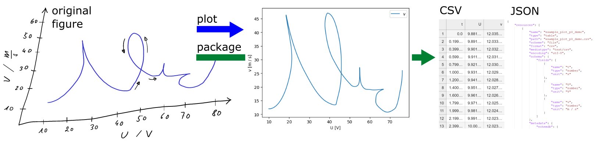

# SVGDigitizer — Extract (x,y) Data Points from SVG files



The `svgdigitizer` allows recovering data from a curve in a figure, plotted in a 2D coordinate system, which is usually found in scientific publications.
The data is accessible either with a command line interface or the API from a specifically prepared scaled vector graphics (SVG) file. The data can be stored as a [frictionless datapackage](https://frictionlessdata.io/) (CSV and JSON) which can be used with [unitpackage](https://echemdb.github.io/echemdb/) to access the plots metadata or create a database of such datapackages.

# Advantages

The `svgdigitizer` has the some advantages compared to other plot digitizers, such as:

* supports **multiple y (x) values per x (y) value**
* usage of splines allows for very **precise retracing** distinct features
* splines can be digitized with specific **sampling intervals**
* supports plots with distorted/**skewed axis**
* **extracts units** from axis labels
* **reconstruct time series** with a given scan rate
* supports **scale bars**
* supports **scaling factors**
* **extracts metadata** associated with the plot in the SVG
* **saves data as [frictionless datapackage](https://frictionlessdata.io/)** (CSV + JSON) allowing for [FAIR](https://en.wikipedia.org/wiki/FAIR_data) data usage
* **inclusion of metadata** in the datapackage
* **Python API** to interact with the retraced data

Refer to our [documentation](https://echemdb.github.io/svgdigitizer/) for more details.

## Installation

Install the latest stable version of `svgdigitizer` from PyPI

```sh
pip install echemdb
```

or conda

```sh
conda install -c conda-forge echemdb
```

Please consult our [documentation](https://echemdb.github.io/svgdigitizer/) for
more detailed [installation instructions](https://echemdb.github.io/svgdigitizer/installation.html).

## Command Line Interface

The CLI allows creating SVG files from PDFs and allows digitizing the processed SVG files. Certain plot types have specific commands to recover different kinds of metadata. Refer to the [CLI documentation](https://echemdb.github.io/svgdigitizer/cli) for more information.

```sh
$ svgdigitizer  # byexample: +term as-is +geometry 80x240
Usage: svgdigitizer [OPTIONS] COMMAND [ARGS]...
  The svgdigitizer suite.
Options:
  --help  Show this message and exit.
Commands:
  cv        Digitize a cylic voltammogram and create a frictionless datapackage.
  digitize  Digitize a plot.
  figure    Digitize a figure with units on the axis and create a frictionless datapackage.
  paginate  Render PDF pages as individual SVG files with linked PNG images.
  plot      Display a plot of the data traced in an SVG.

$ svgdigitizer cv doc/files/mustermann_2021_svgdigitizer_1/mustermann_2021_svgdigitizer_1_f2a_blue.svg --sampling-interval 0.01
```

## API

You can also use the `svgdigitizer` package directly from Python, to access properties of the SVG or additional properties associated with the figure.

```python
>>> from svgdigitizer.svg import SVG
>>> from svgdigitizer.svgplot import SVGPlot
>>> from svgdigitizer.svgfigure import SVGFigure


>>> plot = SVGFigure(SVGPlot(SVG(open('doc/files/others/looping.svg', 'rb')), sampling_interval=0.01))
```

Examples:
`plot.df` provides a dataframe of the digitized curve.
`plot.plot()` shows a plot of the digitized curve.
`plot.metadadata` provides a dict with metadata of the original plot, such as original units of the axis.

The `svgdigitizer` can be enhanced with submodules, which are designed to digitize specific plot types, such sas the submodule `electrochemistry.cv`.
This submodule allows digitizing cyclic voltammograms
commonly found in the field of electrochemistry.

```python
>>> from svgdigitizer.svg import SVG
>>> from svgdigitizer.svgplot import SVGPlot
>>> from svgdigitizer.electrochemistry.cv import CV

>>> cv_svg = 'doc/files/mustermann_2021_svgdigitizer_1/mustermann_2021_svgdigitizer_1_f2a_blue.svg'
>>> cv = CV(SVGPlot(SVG(open(cv_svg, 'rb')), sampling_interval=0.01))
```

The resulting `cv` object has the same properties than the `plot` object above.
