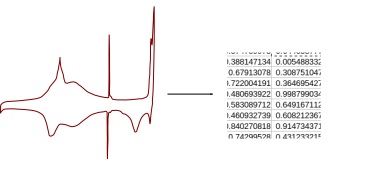

# SVGDigitizer — (x,y) Data Points from SVG files



The purpose of this project is to digitize plots in scientific publications, recovering the measured data visualized in such a plot.

## Installation

Install the latest stable version of svgdigitizer with

```sh
pip install svgdigitizer
```

Please consult our [documentation](https://echemdb.github.io/svgdigitizer/) for
more detailed [installation instructions](https://echemdb.github.io/svgdigitizer/installation.html).

## Command Line Interface

There's a simple command line interface.

```sh
$ svgdigitizer
Usage: svgdigitizer [OPTIONS] COMMAND [ARGS]...
  The svgdigitizer suite.
Options:
  --help  Show this message and exit.
Commands:
  cv        Digitize a cylic voltammogram.
  digitize  Digitize a plot.
  paginate  Render PDF pages as individual SVG files with linked PNG images.
  plot      Display a plot of the data traced in an SVG.

$ svgdigitizer plot test/data/xy.svg  # byexample: +skip
[displays a plot]

$ svgdigitizer digitize test/data/xy.svg
$ head test/data/xy.csv  # byexample: +pass
x,y
-0.16009930563414798,-0.1986285897538036
-0.15992739743885453,-0.1957901668705444
-0.1597554892435611,-0.19295174398728543
-0.15958358104826764,-0.19011347237363185
-0.1594116728529742,-0.18727504949037288
-0.15923976465768075,-0.1844366266071139
-0.1590678564623873,-0.18159820372385482
-0.15889594826709386,-0.17875993211020125
-0.1587240400718004,-0.17592150922694227

$ svgdigitizer paginate test/data/mustermann_2021_svgdigitizer_1.pdf
$ ls test/data/mustermann_*
test/data/mustermann_2021_svgdigitizer_1.pdf
test/data/mustermann_2021_svgdigitizer_1_p0.png
test/data/mustermann_2021_svgdigitizer_1_p0.svg
test/data/mustermann_2021_svgdigitizer_1_p1.png
test/data/mustermann_2021_svgdigitizer_1_p1.svg
test/data/mustermann_2021_svgdigitizer_1_p2.png
test/data/mustermann_2021_svgdigitizer_1_p2.svg
test/data/mustermann_2021_svgdigitizer_1_p3.png
test/data/mustermann_2021_svgdigitizer_1_p3.svg

$ svgdigitizer cv doc/files/mustermann_2021_svgdigitizer_1/mustermann_2021_svgdigitizer_1_p1_2a_blue.svg
$ head doc/files/mustermann_2021_svgdigitizer_1/mustermann_2021_svgdigitizer_1_p1_2a_blue.csv  # byexample: +pass
t,E,j
0.0,-0.0960124785649914,-2.080260291844327
0.7905675531192768,-0.05648410090902756,-1.0308948282866481
2.248602982368486,0.016417670553432906,-0.16935125824021272
3.987638717224935,0.10336945729625535,0.1323211424212127
5.432216587072722,0.17559835078864472,0.8935782484922993
6.137505185508352,0.2108627807104262,1.1030689590733505
7.034812039233036,0.2557281233966604,0.594205898184805
7.6578480240944335,0.2868799226397303,0.36151217639411015
8.628013087315537,0.3353881758007855,0.25379596409161875
```

## API

You can also use the `svgdigitizer` package directly from Python.

The examples are based on the test files provided with `svgdigitizer` in the folder `test/data`.

```python
>>> from svgdigitizer.svgplot import SVGPlot
>>> from svgdigitizer.svg import SVG

>>> svgplot = SVGPlot(SVG(open('test/data/xy_rate.svg', 'rb')))
```

`svgplot.df` provides a dataframe of the digitized curve.
`svgplot.plot()` shows a plot of the digitized curve.


## Submodule CV

The submodule `electrochemistry.cv` is specifically designed to digitize cyclic voltammograms
commonly found in the field of electrochemistry.

```python
>>> from svgdigitizer.svgplot import SVGPlot
>>> from svgdigitizer.svg import SVG
>>> from svgdigitizer.electrochemistry.cv import CV

>>> cv = CV(SVGPlot(SVG(open('test/data/xy_rate.svg', 'rb'))))
```

`cv.df` provides a dataframe with a time, voltage and current axis (in SI units). Depending on the type of data the current is expressed as current `I` in `A` or a current density `j` in `A / m2`.

The dataframe can for example be saved as `csv` via:

```python
from pathlib import Path
cv.df.to_csv(Path(svgfile).with_suffix('.csv'), index=False)
```

`cv.plot()` shows a plot of the digitizd data with appropriate axis labels.
`cv.metadadata` provides a dict with metadata of the original plot, such as original units of the axis.


`CV` also accepts a dict with metadata, which is updated with keywords related to the original figure (`figure descripton`), i.e., original axis units.

```python
>>> import yaml
>>> from svgdigitizer.svgplot import SVGPlot
>>> from svgdigitizer.svg import SVG
>>> from svgdigitizer.electrochemistry.cv import CV

>>> with open('test/data/xy_rate.yaml') as f:
...    metadata = yaml.load(f, Loader=yaml.SafeLoader)

>>> cv = CV(SVGPlot(SVG(open('test/data/xy_rate.svg', 'rb'))), metadata=metadata)
```
