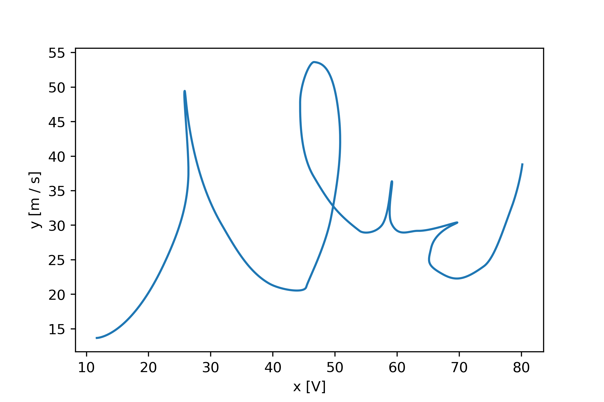

Welcome to svgdigitizer's documentation!
========================================

<!--
```{todo}
* what is svgdigitizer and what is our aim.
* then refer to installation, cli, api and cv.
```
-->

Svgdigitizer allows recovering data from a curve, plotted in a 2D coordinate 
system with defined axes.
Such plots are often found in scientific publications, where
in many cases, especially for old pulications, the underlying data 
is not accessible anymore. 
In some cases, the axis of the plot can be a bit skewed, caused from scanning 
printed documents. An extreme case for such a plot is depicted in the following figure.

 

In order to recover the underlying data, first the plot is imported in a 
vector graphics program, such as [Inkscape](https://inkscape.org/).
The curve is traced with *regular bezier path* and two points are marked 
with a group of textlabel and line on each axis to define the coordinate system.
The curve should be assigned a text label. Additonal labels describing the data 
can be provided anywhere in the SVG file. The resulting file looks as follows:

 

This file can be digitized from the [command line interface](cli.md), which creates a CVS file of the y and y data. 
The resolution can be specified by `--sampling-interval`.

```sh
svgdigitizer digitize example_plot_p0_demo.svg --sampling-interval 0.01
```

With the [API](api.md), the file can also be used to create an actual [SVGplot class](api/svgplot.md).

```python
>>> from svgdigitizer.svg import SVG
>>> from svgdigitizer.svgplot import SVGPlot

>>> plot = SVGPlot(SVG(open('./svgdigitizer/doc/files/others/example_plot_p0_demo.svg', 'r')), sampling_interval=0.01)
```

Now one can query things such as the axis labels or any other text label in the SVG file.
```python
>>> plot.axis_labels
{'x': 'V', 'y': 'm / s'}

>>> plot.svg.get_texts()
[<text>curve: blue</text>,
 <text>x2: 80 V</text>,
 <text>x1: 10 V</text>,
 <text>y1: 10 m / s</text>,
 <text>y2: 60 m / s</text>,
 <text>comment: random data</text>,
 <text>operator: Mr. X</text>]
```

A plot can be created via
```python
>>> plot.plot()
```
 

Installation
============

The package is hosted on [PiPY](https://pypi.org/project/svgdigitizer/) and can be installed via

```sh
pip install svgdigitizer
```

Read the [installation instructions](installation.md) on further details if you want to contribut to the project.

Further information
===================

The svgdigitizer can be enhanced with other modules for specific datasets.

Currently the following datasets are supported:
* cyclic voltammograms (I vs. E - current vs. potential curves or j vs. E - current density vs. potential curves) commonly found in electrochemistry. For further details refer to the specific instructions to [digitize CVs](workflow.md).

We would be delighted if you would [cite](https://zenodo.org/record/5881475) our project when you use the svgdigitizer.

```{toctree}
:maxdepth: 2
:caption: "Contents:"
:hidden:
installation.md
cli.md
api.md
api/cv.md
workflow.md
```
