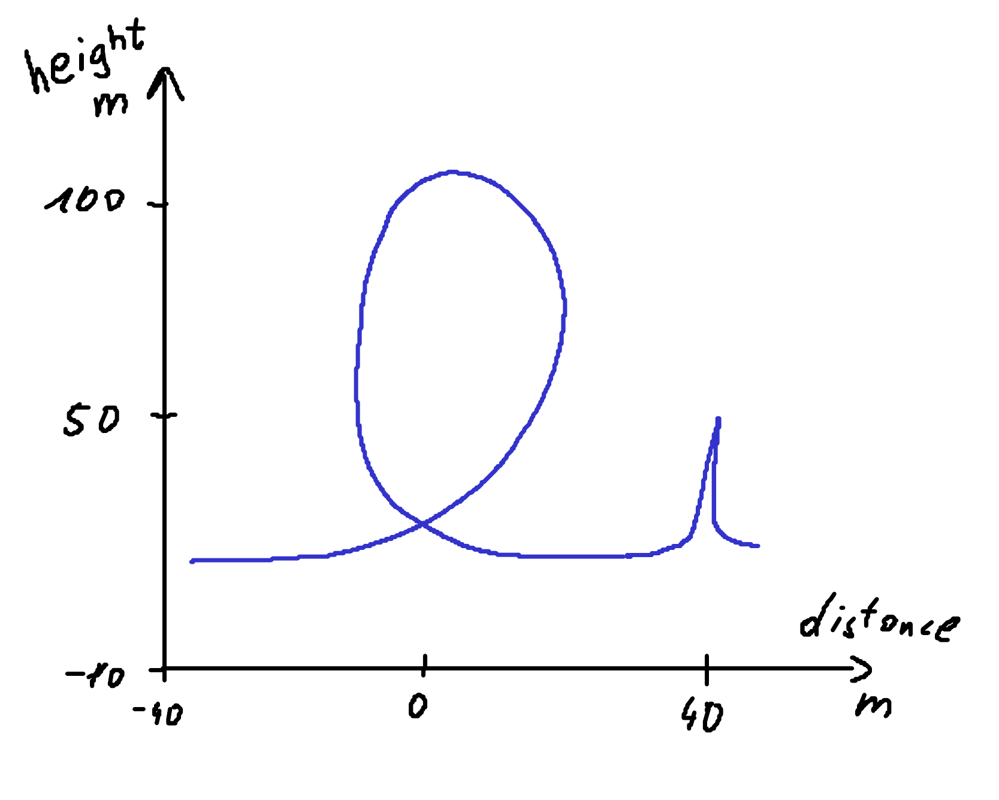
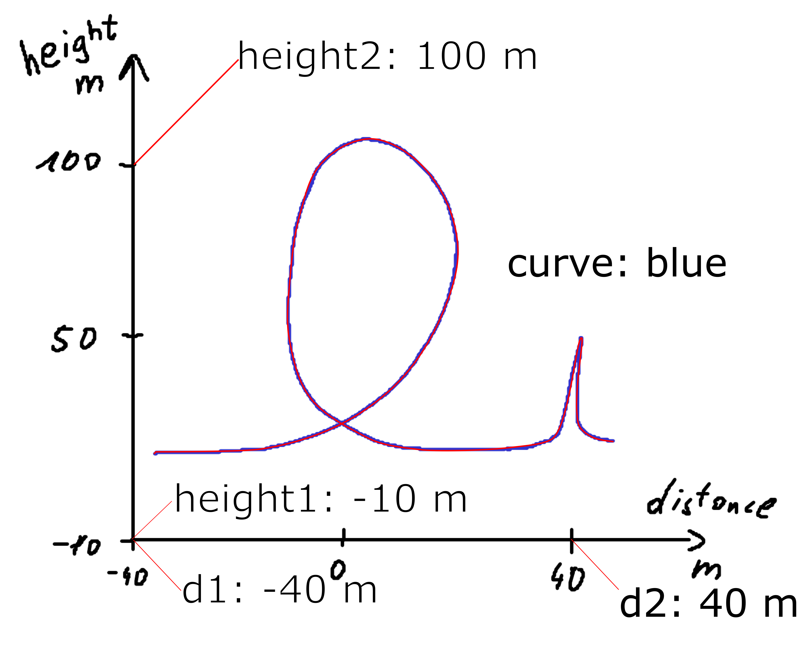
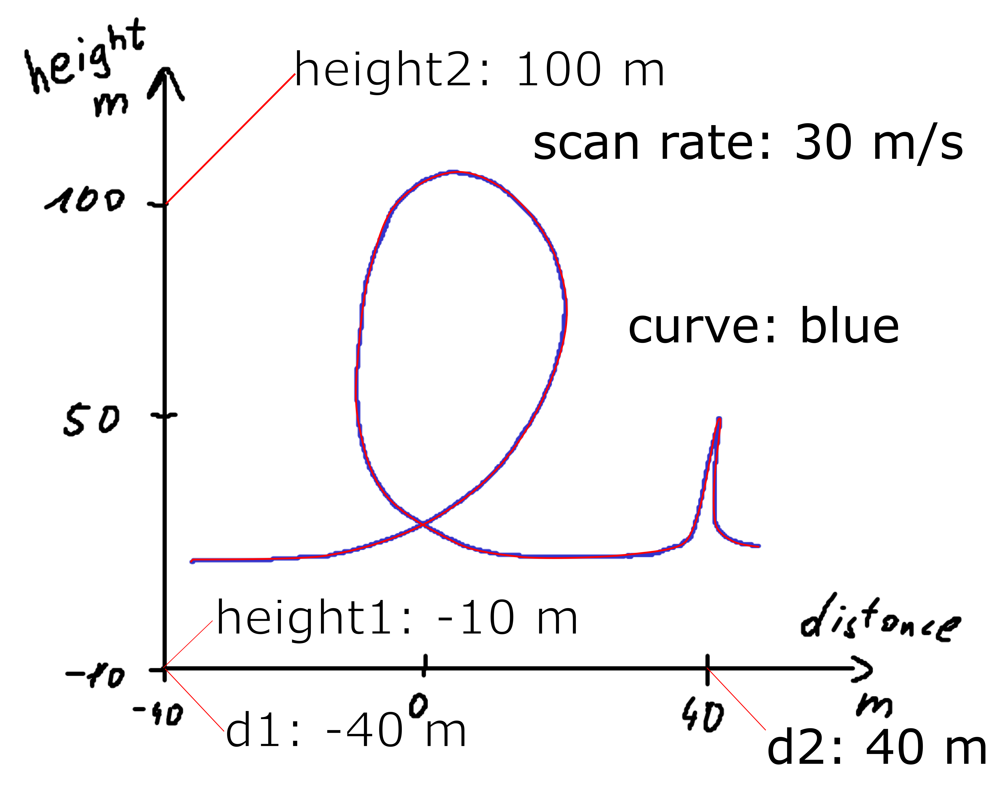

---
jupytext:
  formats: ipynb,md:myst
  text_representation:
    extension: .md
    format_name: myst
    format_version: 0.13
    jupytext_version: 1.14.5
kernelspec:
  display_name: Python 3 (ipykernel)
  language: python
  name: python3
---

Usage
=====

The SVG files used throughout this documentation (as well as those used for testing `svgdigitizer`), were create with [Inkscape](https://inkscape.org/) (tested with V. 0.92 and V. 1.1).

## Prepare the SVG

### From an Image File

Import an image file into an empty Inkscape document (For example, via drag and drop).

```{hint}
We suggest linking the image in the SVG, since embedded pictures increase the time required for `svgdigitizer` to retrace the curve.
```

```{hint}
Lock the image file in the *Layers and Objects* pane, which turns the image sort of into a static background object.
```

### From PDF

When the figure is included inside a PDF use the svgdigitizer [CLI](/cli.md) to create an SVG from the PDF by typing.

```sh
svgdigitizer paginate publication.pdf
```

An SVG file is created for each page of the PDF. The image is locked and acts as static background object.

## SVG Annotation

### Minimum requirements

We consider the example figure in the tile to the left in the table below.
The minimum requirements to digitize such a plot with `svgdigitizer` are:

* marking two points on each axis with a group containing a text label and line pointing at a position on the axis. The label must be of type `x1: 10`, `x2: 100`, `y1: ...`, and `y2: ...`.
  * `x` and `y` can also be replaced with dimensions, such as `U`, `T`, `elephants` etc.
  * The number can also be followed by a unit, such as `T1: 20 K` or `v1: 20 km / s`. (see [more on units below](units))
* Tracing the curve with a *bezier path*  which is grouped with a text label of type `curve: identifier` (see [below for details](curvetracing))

An annotated example is in the right pane of the table below ({download}`annotated SVG <./files/others/looping.svg>`).

````{grid} 2
:outline:

```{grid-item}
Original

```
```{grid-item}
Annotated SVG

```
````

The figure can be retraced in 0.1 steps (with respect to the x-axis values) via

```sh
svgdigitizer digitizer looping.svg --sampling_interval 0.1
```

(curvetracing)=
### Curve Tracing

**Step 1**: Select the the tool `Draw Bezier curves`  and select the mode `Create regular Bezier path`. Try using as few nodes as possible. It is desired that a node is placed at maxima of sharp peaks. This way these features are not missed when using low sampling rates.


Select the curve, select the tool `Edit paths by node`, and select all nodes by pressing `CTRL-a`. Click on the option `make selected nodes smooth`.

Click on individual nodes and adjust the handles such that the path matches the curve in the plot. Eventually adjust the position of the nodes. Do this for each node until you are satisfied with the result.


**Step 2**: Add a text field and name it `curve: identifier`, which in this case could be `curve: blue`.

**Step 3**: Group the text field and the curve.


(units)=
### Units

Units should be provided in the [astropy format](https://docs.astropy.org/en/stable/units/index.html). In brief:

* [Standard units](https://docs.astropy.org/en/stable/units/standard_units.html) simply read: `V`, `A` or `m`.
* Units can be preceeded by common prefixes, i.e., `mV`, `kV` or `uV`. (Note that $\mu$ is `u`.)
* fractions read as follows: `mV / s`, `mA / cm2`.
* For square, cubic, etc units simply add `2`, `3`, ... to the unit (see above).
* Use parentheses if more than one unit is in the numerator or denominator, i.e., `(kg m) / s2`

### Time Series Data

Usually data is recored with a certain rate (unit per unit time) resulting in time series data. In a plot, however, often two variables are plotted one against another. For example, assume a cyclist is riding his bike through a looping at a constant velocity of 30 m/s. The following figure shows the position of the cyclist in terms of distance and height. By adding a text label `scan rate: 30 m / s` the [`SVGFigure`](api/svgfigure.md) module is able to reconstruct the time axis.

```{code-cell} ipython3
:tags: ["remove-input", "remove-output"]
from myst_nb import glue
from svgdigitizer.svg import SVG
from svgdigitizer.svgplot import SVGPlot

plot = SVGPlot(SVG(open('./files/others/looping_scan_rate.svg', 'rb')), sampling_interval=0.01, algorithm='mark-aligned')
df = plot.df.head(8)
glue("rate_df", df)
```

````{grid} 2
:outline:

```{grid-item}
Annotated SVG

```
```{grid-item}
dataframe
{glue:}`rate_df`
```
````


<!-- ### Mark axis coordinates and labels

To create a coordinate system, we mark two points on each axis with a text label and a line pointing on the x/y-coordinate. **The text label and the lines must be grouped**.

In the SVG file, by marking two positions on each axis, both the units and the scale of the axis will be extracted.

In the example, the first position on the x-axis will be 0.0 V vs RHE. Add a text label that contains `E1: 0.0 V vs RHE`. Draw a line connecting the text label and the position on the x-axis. Finally **group** the **line** and the **text label**.

Repeat this for positions `E2`, `j1` and `j2`.

````{tab-set}
```{tab-item} CLI
`CLI command`
```

```{tab-item} API
`API code`!
```
````
-->

## Plot Types

### Scalebars

### Scaling Factors

### Skewed Plots

### Scatter Plots

### Bar Plots
