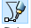
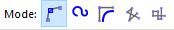
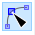
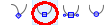

---
jupytext:
  formats: ipynb,md:myst
  text_representation:
    extension: .md
    format_name: myst
    format_version: 0.13
    jupytext_version: 1.14.5
kernelspec:
  display_name: Python 3 (ipykernel)
  language: python
  name: python3
---

Usage
=====

The SVG files used throughout this documentation (as well as those used for testing `svgdigitizer`), were create with [Inkscape](https://inkscape.org/) (tested with V. 0.92 and V. 1.1). All files are available for download from the [repository](https://github.com/echemdb/svgdigitizer/tree/master/doc/files/others).

```{note}
The preceding `!` in the following CLI examples is used to evaluate shell commands in [jupyter notebooks](https://jupyter-tutorial.readthedocs.io/en/latest/notebook/example.html). Remove the `!` to evaluate the command in the shell.
```

## Prepare the SVG

### From an Image File

Import an image file into an empty Inkscape document, for example, via drag and drop.

```{hint}
We suggest linking the image in the SVG, since embedded pictures seem to increase the time required for `svgdigitizer` to retrace the curve (see [#19](https://github.com/echemdb/svgdigitizer/issues/19)).
```

```{hint}
It is recommended to lock the image file in the *Layers and Objects* pane, which turns the image sort of into a static background object and thus can not be moved during the SVG annotation.
```

### From PDF

When the figure is included inside a PDF use the svgdigitizer [CLI](/cli.md) to create an SVG from the PDF by typing.

```{code-cell} ipython3
:tags: [remove-stderr]

!svgdigitizer paginate ./files/others/looping.pdf
```

An SVG file is created for each page of the PDF. The image is locked and acts as static background object.

## SVG Annotation (Basics)

We consider the following {download}`example figure<./files/others/example_plot_p0.png>`.

```{image} ./files/others/looping_p0.png
:width: 500px
:align: center
```

The minimum requirements to digitize such a figure with `svgdigitizer` are:

* marking two points on each axis with a group containing a text label and line pointing at a position on the axis. The label must be of type `x1: -40`, `x2: 40`, `y1: -10`, and `y2: 100`.
  * `x` and `y` can also be replaced with dimensions, such as `U`, `T`, `elephants` etc.
  * The number can also be followed by a unit, such as `T1: 20 K` or `v1: 20 km / s`. (see [more on units below](units))
* Tracing the curve with a *bezier path*  which is grouped with a text label of type `curve: identifier` ([see below](curvetracing))

An {download}`annotated SVG <./files/others/looping.svg>` of the example figure is shown below.

```{image} ./files/others/looping_annotated.png
:class: bg-primary mb-1
:width: 500px
:align: center
```

The figure can be retraced, for example in 0.01 steps, with respect to the x-axis values with the API.

```{code-cell} ipython3
:align: center

from svgdigitizer.svg import SVG
from svgdigitizer.svgplot import SVGPlot
from svgdigitizer.svgfigure import SVGFigure

svg = './files/others/looping.svg'
plot = SVGFigure(SVGPlot(SVG(open(svg, 'rb')), sampling_interval=0.01))
plot.plot()
```

Alternatively the data can be digitized with the [CLI](cli.md)

```{code-cell} ipython3
:tags: [remove-stderr]

!svgdigitizer figure looping.svg --sampling_interval 0.01
```

(curvetracing)=
### Curve Tracing

**Step 1**: Select the the tool `Draw Bezier curves`  and select the mode `Create regular Bezier path`. Try using as few nodes as possible. It is desired that a node is placed at maxima of sharp peaks. This way these features are not missed when using low sampling rates.

```{image} ./files/others/looping_marked_points.png
:width: 350px
:align: center
```

```{note}
You can omit **step 2** when you want to retrace a scatter plot, unless you whish to reconstruct possible missing datapoints in between.
```

**Step 2**: Select the curve, select the tool `Edit paths by node`, and select all nodes by pressing `CTRL-a`. Click on the option `make selected nodes smooth`.

Click on individual nodes and adjust the handles such that the path matches the curve in the plot. Eventually adjust the position of the nodes or add additional nodes. Do this for each node until you are satisfied with the result.

```{image} ./files/others/looping_smoothed_curve.png
:class: bg-primary mb-1
:width: 350px
:align: center
```

**Step 3**: Add a text field and name it `curve: identifier`, which in this case could be `curve: blue`.

```{note}
The identifier is relevant when multiple curves can be found in a single plot.
```

**Step 4**: Group the text field and the curve.

```{image} ./files/others/looping_grouped_curve.png
:class: bg-primary mb-1
:width: 350px
:align: center
```

(units)=
### Units

Units should be provided in the [astropy format](https://docs.astropy.org/en/stable/units/index.html). In brief:

* [Standard units](https://docs.astropy.org/en/stable/units/standard_units.html) simply read: `V`, `A` or `m`.
* Units can be preceeded by common prefixes, i.e., `mV`, `kV` or `uV`. (Note that {math}`\mu` is `u`.)
* fractions read as follows: `mV / s`, `mA / cm2`.
* For square, cubic, etc units simply add `2`, `3`, ... to the unit (see above).
* Use parentheses if more than one unit is in the numerator or denominator, i.e., `(kg m) / s2`

## Advanced plots

Data can be presented in different ways in figures and eventually some additional information can be extracted from a properly annotated SVG. For example, `svgdigitizer` is able to reconstruct a time axis from a scan rate, remove distortion from skewed axis, reconstruct data from scale bars, or apply scaling factors.

### Time Series (Scan Rate)

Usually data is recorded with a certain rate (unit per unit time), measuring another variable, resulting in 2D time series data. In a plot, however, often the two variables are plotted one against another and the temporal information is lost. For example, assume a cyclist is riding his bike through a looping at a constant velocity of 30 m/s. The following figure shows the position of the cyclist in terms of distance and height. By adding a text label `scan rate: 30 m / s` the [`SVGFigure`](api/svgfigure.md) module is able to reconstruct the time axis.

```{image} ./files/others/looping_scan_rate_annotated.png
:class: bg-primary mb-1
:width: 500px
:align: center
```

The resulting data

```{code-cell} ipython3
:align: center

from svgdigitizer.svg import SVG
from svgdigitizer.svgplot import SVGPlot
from svgdigitizer.svgfigure import SVGFigure

svg = './files/others/looping_scan_rate.svg'
plot = SVGFigure(SVGPlot(SVG(open(svg, 'rb')), algorithm='mark-aligned', sampling_interval=0.01))
plot.df.head(8)
```

### Skewed Figures

Figures can have distorted (skewed) axis. Such plots can, for example, be found in old scanned publications, such as in the following example.

```{image} ./files/others/example_plot_p0.png
:class: bg-primary mb-1
:width: 500px
:align: center
```

To remove the distorition first {download}`annotate the SVG <./files/others/example_plot_skewed.svg>` in the same way as in the basic example.

```{image} ./files/others/example_plot_skewed_annotated.png
:class: bg-primary mb-1
:width: 500px
:align: center
```

To digitize the SVG add the argument `algorithm='mark-aligned'`, upon invoking the `SVGPlot` object.

```{warning}
To remove the distortion a superficial coordinate system is created from the position of the labels on both axis (straight lines connect these points). Thus the distortion along the axis is not resolved by this approach and thus the data might deviate slightly from the original data.
```

```{code-cell} ipython3
:tags: [remove-stderr]

from svgdigitizer.svg import SVG
from svgdigitizer.svgplot import SVGPlot
from svgdigitizer.svgfigure import SVGFigure

svg = './files/others/example_plot_skewed.svg'
plot = SVGFigure(SVGPlot(SVG(open(svg, 'rb')), algorithm='mark-aligned', sampling_interval=0.01))
plot.plot()
```

Alternatively use the [CLI](cli.md) and add the option `--skewed`

```{code-cell} ipython3
:tags: [remove-stderr]

!svgdigitizer figure ./files/others/example_plot_skewed.svg --skewed --sampling-interval 0.01
```

### Scaling Factors

To compare data with signals of different magnitude, eventually the dataset with the lower magnitude is rescaled with a certain factor. Such factors are usually provided in the scientific figure (or its caption).

```{image} ./files/others/looping_scaling_factor_p0.png
:class: bg-primary mb-1
:width: 500px
:align: center
```

To rescale the resulting data, add a text field, such as `x_scaling_factor: 8.3`, where `x` should be the name of the dimension on the respective axis.
An {download}`annotated SVG <./files/others/looping_scaling_factor.svg>` looks as follows.

```{image} ./files/others/looping_scaling_factor_annotated.png
:class: bg-primary mb-1
:width: 500px
:align: center
```

The data can be acquired without further options with the API

```{code-cell} ipython3
:tags: [remove-stderr]

from svgdigitizer.svg import SVG
from svgdigitizer.svgplot import SVGPlot
from svgdigitizer.svgfigure import SVGFigure

svg = './files/others/looping_scaling_factor.svg'
plot = SVGFigure(SVGPlot(SVG(open(svg, 'rb')), sampling_interval=0.01))
plot.plot()
```

or simply by using one of the digitizing options of the [CLI](cli.md).

```{code-cell} ipython3
:tags: [remove-stderr]

!svgdigitizer figure ./files/others/looping_scaling_factor.svg --sampling-interval 0.01
```

### Scale Bars

Some published data are lacking a y-scale. Instead a scale bar is shown, which provides information on the magnitude of the features observed in such a figure such as in the following example.

```{image} ./files/others/looping_scale_bar_p0.png
:class: bg-primary mb-1
:width: 500px
:align: center
```

To extract the data one has to know at least one point on the y-axis
(usually a baseline is provided as in the example above).
That point as is annotated as in the simple example above with a text label, such as `x1: 0 m`,
where x can be the dimension of the x-axis, grouped with a line pointing to the respective origin
For the scale bar add a text label, such as, `x_scale_bar: 40 m`, where `x` should be the same label as that used for the origin.
In addition draw two lines pointing to both extremes of the scale bar, and group these lines with the label.
An {download}`annotated SVG <./files/others/looping_scale_bar.svg>` looks as follows.

```{note}
This approach also works for scale bars for the x-axis or both x- and y-axis.
```

```{image} ./files/others/looping_scale_bar_annotated.png
:class: bg-primary mb-1
:width: 500px
:align: center
```

The data can be acquired without further options with the API

```{code-cell} ipython3
:tags: [remove-stderr]

from svgdigitizer.svg import SVG
from svgdigitizer.svgplot import SVGPlot
from svgdigitizer.svgfigure import SVGFigure

svg = './files/others/looping_scale_bar.svg'
plot = SVGFigure(SVGPlot(SVG(open(svg, 'rb')), sampling_interval=0.01))
plot.plot()
```

or simply by using one of the digitizing options of the [CLI](cli.md).

```{code-cell} ipython3
:tags: [remove-stderr]

!svgdigitizer figure ./files/others/looping_scale_bar.svg --sampling-interval 0.01
```

### Scatter Plots

Some text

```{image} ./files/others/scatter_plot_p0.png
:class: bg-primary mb-1
:width: 500px
:align: center
```

To remove the distorition first {download}`annotate the SVG <./files/others/scatter_plot.svg>` in the same way as in the basic example.

```{image} ./files/others/scatter_plot_annotated.png
:class: bg-primary mb-1
:width: 500px
:align: center
```

The data can be acquired with the API without specifying a sampling interval.

```{code-cell} ipython3
:tags: [remove-stderr]

from svgdigitizer.svg import SVG
from svgdigitizer.svgplot import SVGPlot
from svgdigitizer.svgfigure import SVGFigure

svg = './files/others/scatter_plot.svg'
plot = SVGFigure(SVGPlot(SVG(open(svg, 'rb'))))
plot.df.plot.scatter('d', 'height', color='red')
```

Alternatively use one of the digitizing options of the [CLI](cli.md), omitting the `--sampling-interval` option.

```{code-cell} ipython3
:tags: [remove-stderr]

!svgdigitizer figure ./files/others/looping_scale_bar.svg
```

```{note}
All other advanced annotation options above, such as a scan rate, scale bar, scaling factor, ... are equally applicable to scatter plots.
```

## Datapackage Interaction

The datapackages obtained with the `svgdigitizer` can be used along with the [frictionless framework](https://framework.frictionlessdata.io/).

```{code-cell} ipython3
:tags: [output_scroll]

from frictionless import Package
package = Package('./files/others/looping_scan_rate.json')
package
```

Alternatively use the [`unitpackage` module](https://echemdb.github.io/unitpackage/), which is specifically designed for datapackages with additional metadata and columns containing units. It also allows creating a database from all packages within a folder.

<!-- We do not evaluate the cell. Otherwise we would create a circular dependence between svgdigitizer and echemdb. -->

```python
from unitpackage.local import collect_packages
from unitpackage.database import Collection
db = Collection(packages=collect_packages('./files/others/'))
entry = db['looping_scan_rate']
entry.df
```
