# Digitizing CVs for echemdb

The cyclic voltammogram we trace is provided in Figure 2a in the [publication example](publication_example.pdf) and looks as follows:

[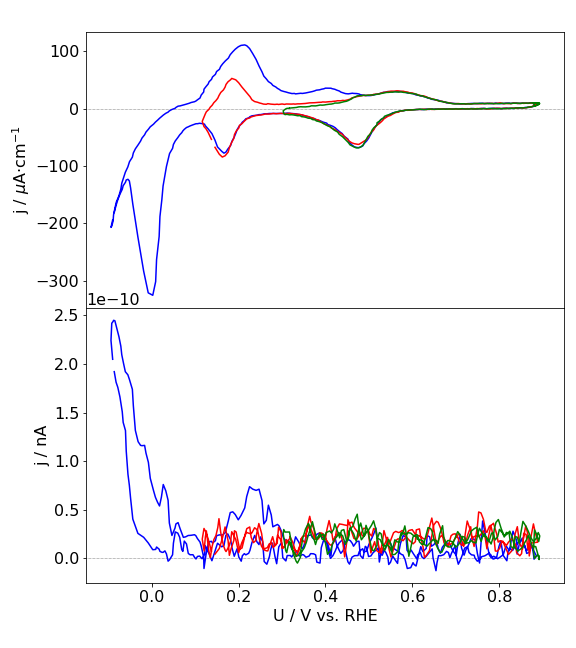](sample_data_2.png)

## Step 1: pdf, bib and metadata file preparation

**1: Create a folder with the pdf, where the folder name is:**

`FirstAuthorName_Year_FirstTitleWord_FirstPageNr`

For the example pdf this comes down to

`mustermann_2021_svgdigitizer_1`

The Page number should be the page number in the published pdf. Since the example is not published the page number is `1`. In other cases this could be `1021`.

The pdf should be named according to the same scheme:

`mustermann_2021_svgdigitizer_1.pdf`

**2: Place a bib file in the folder.**

The most simple approach is to search the article with [Google Scholar](http://scholar.google.com/).

Modify the scholar settings that a bibtex link appears below the citation:

Click on the 3 lines next to the Google Scholar logo

Choose Settings

Select `Show links to import citatons into BibTex"

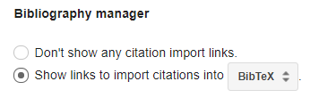

An `import into BbTex` link appears below the linked article:

Download the bib file or save the content to a file named:

`mustermann_2021_svgdigitizer_1.bib`

Open the file and change the key, such that it matches the folder name:

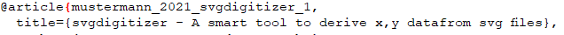  

**Finally the folder should now contain the following files:**

`mustermann_2021_svgdigitizer_1.bib`

`mustermann_2021_svgdigitizer_1.pdf`

## Step 2: Prepare svg and png files from the pdf

Install the `svgdigitizer`.

In a shell use `svgdigitizer paginate mustermann_2021_svgdigitizer_1.pdf` to create for each page of the pdf an `svg` and a `png` file in the same folder.

The filenames look as follows:

`mustermann_2021_svgdigitizer_1_p0.png`

`mustermann_2021_svgdigitizer_1_p0.svg`

**Note:** The page count starts from 0. It also does not reflect the original page number in the pdf.

## Step 4: Digitize a plot

**1: Select an svg file with a plot to be digitized**

For this example we use inkscape to digitize some data in plot 2a in the pdf, which is is located on page two of the manuscript (filename containing `_p1`). The plot contains three curves, which can be identified by their colors. Preferably each digitized curve should be placed in a single svg file. Therefore, create a copy of the svg file of page two (`mustermann_2021_svgdigitizer_1_p1.svg`) and rename it to`mustermann_2021_svgdigitizer_1_p0_2b_blue.svg`, to indicate that this files contains the digitized curve of the blue curve in Figure 2a on page 2. 

 **2: Select the curve in the svg file**

1. Open the svg file.

2. Click on the image of the pdf page, select `Object properties`, select `Lock` and press `Set`. This prevents the user from moving the image around in the file.

   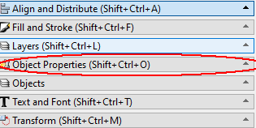

   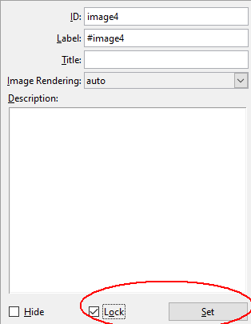

3. Select two positions on for each axis (x and y). The first position on the x-axis will be 0.0 V vs RHE. Add a textlabel which contains `x1: 0.0 V vs RHE`. Draw a line from connecting the textlabel and the position on the x-axis. Finally group the line and the textlabel. Repeat this for positions `x2`, `y1` and `y2`.

   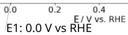

   **Some notes on labels:**

   * In principle the units have to be provided only on the `x2` and `y2` position. 
   * $\mu$ can be used, but it is more convenient to use `u`instead.
   * $^{-2}$ can be written as `-2`
   * The reference on the voltage axis is not always given in the plot. Extract this information from the manuscript text.

   

   When all positions are selected the plot looks like the following:

   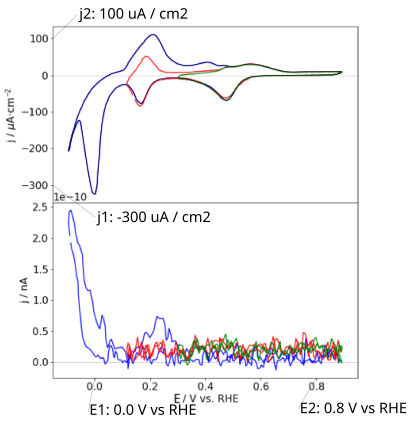

4. Roughly trace the blue curve with a spline by selecting the the tool `Draw Bezier curves` and select the mode `Create regular Bezier path`.

   

   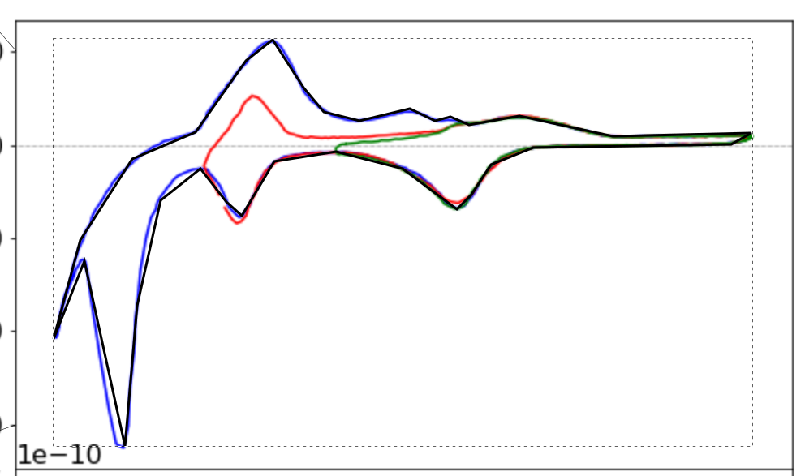

   Select the curve, select the tool `Edit paths by node`, and sleect all nodes by pressing `CTR-a`. Click on the option `make sleected nodes smooth`.

   Click on individual nodes and adjust the handles, such that the path matches the curve in the plot. Eventually adjust the position of the nodes. Do this for each node until you are satisfied with the result.

   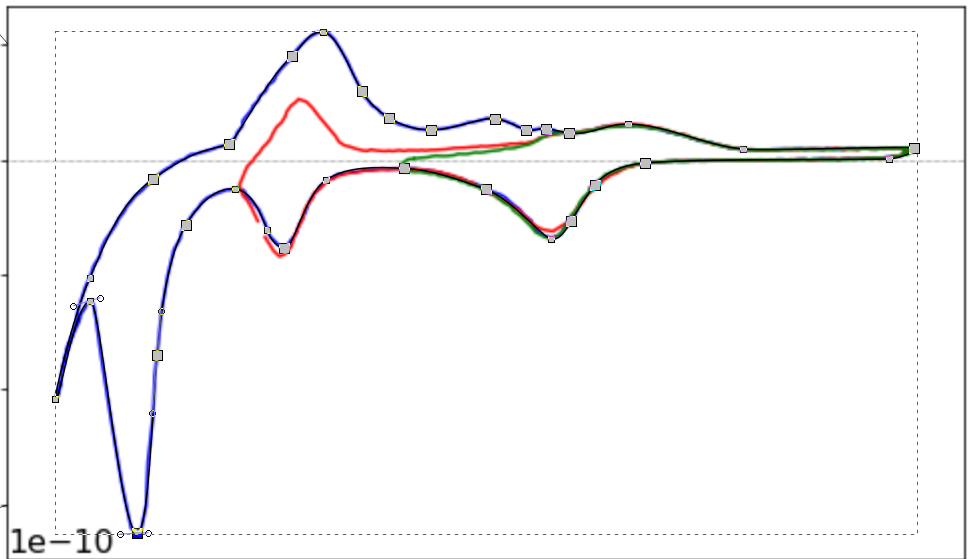

   

   

5. Add a textfield next to the spline and name it `curve: identifier`, which in our case would be `curve: blue`

6. Group the textfield and the spline

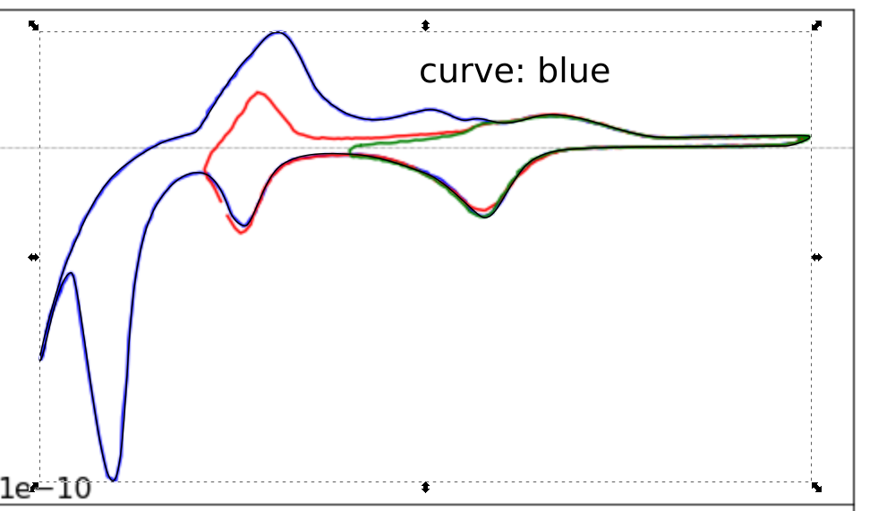

7. Add a textfield to the plot containing the scan rate, with which the data was acquired. This is not necessarily given in the plot or figure description and might have to extracted from the text fo the manuscript. `scan rate: 50 mV / s` or `rate: 50 mV / s`.

The final file should look like this:

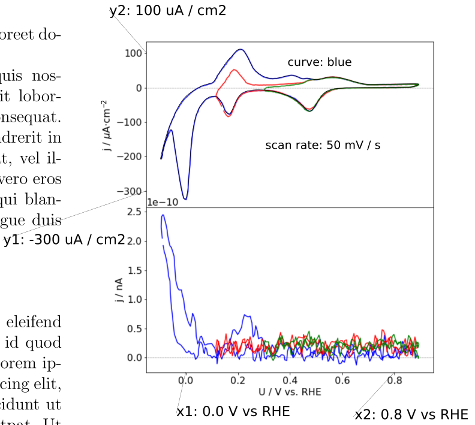

8

## Step 3: Create a metadata file for each digitized curve

Create a yaml file with the same name than the svg file:`mustermann_2021_svgdigitizer_1_p0_2b_blue.yaml`

**TODO:** Templates for various systems can be found in the examples section of the [electrochemistry-metdadata-schema](https://github.com/echemdb/electrochemistry-metadata-schema). The example yaml file for the example plot is located [here](./files/mustermann_2021_svgdigitizer_1/mustermann_2021_svgdigitizer_1_p1_2a_blue.yaml).

Adjust all keys in the fle according to the content of the research article.

## Step 4: Upload to website

Place the folder in website/Literature and create a pull request.

## Notes

If you want to test if your file is working, use the function 

`svgdigitize cv mustermann_2021_svgdigitizer_1_p0_2b_blue.svg --metadata mustermann_2021_svgdigitizer_1_p0_2b_blue.yaml --package`

This provides a csv with the data of the plot and a json package file.

